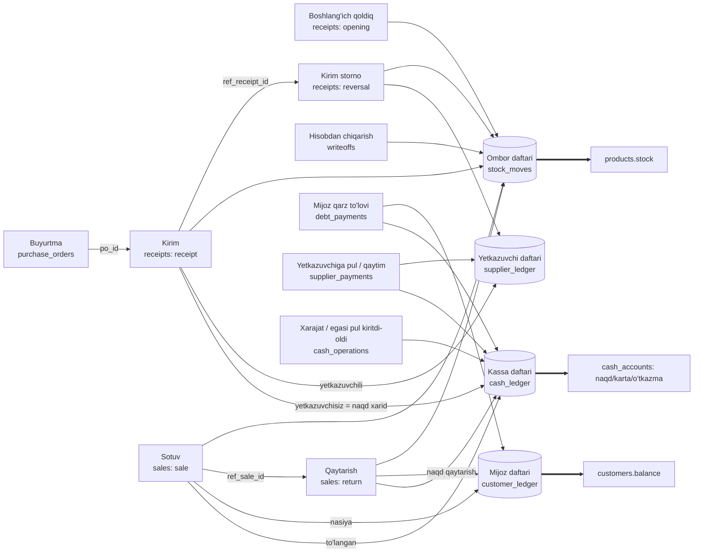

# Hujjatlar zanjiri (document flow)

Tizimdagi har bir hujjat o'zi kelib chiqqan hujjatga, ombor/qarz daftariga va qatorlariga **bazada** bog'langan. Shu tufayli:

- **yo'qdan bor bo'lmaydi** — qoldiq yoki qarz hujjatsiz paydo bo'lmaydi;
- **bordan yo'q bo'lmaydi** — hech narsa o'chirilmaydi, hujjat o'zgarmaydi, tuzatish faqat teskari hujjat bilan.

Umumiy qoidalar va aktiv/noaktiv holat: [README → Ma'lumot yaxlitligi](../README.md#malumot-yaxlitligi-sap-tamoyillari). Bozordagi yechimlar bilan taqqoslash: [BOZOR_TAHLILI.md](BOZOR_TAHLILI.md).

## Xarita

`==>` — qoldiq, qarz va kassa **faqat** daftar orqali o'zgaradi (to'g'ridan-to'g'ri `UPDATE` bazada rad etiladi).

Yetkazuvchi hisobi: musbat saldo — biz qarzdormiz; **manfiy saldo — yetkazuvchida bizning avansimiz**. Avans bergach (`payment`) saldo manfiy bo'ladi, shu yetkazuvchidan tovar qabul qilinganda (`receipt`) avtomatik ayriladi; ishlatilmagan avansni qaytarib olish (`refund`) kassani oshiradi. Moliyaviy hisobotlar: [README → Moliya](../README.md#moliya-foyda-daromad-kassa).

## Har bir hujjat

| Hujjat | Jadval | Nimaga bog'liq | Ombor/qarzga ta'siri | Tuzatish usuli |
|---|---|---|---|---|
| Buyurtma | `purchase_orders` + `po_items` | yetkazib beruvchi | yo'q (faqat reja) | holat: `ordered` → `received`/`cancelled` |
| Kirim | `receipts` (`receipt`) + `receipt_items` | buyurtma (`po_id`, ixtiyoriy), yetkazuvchi | ombor `+` (`receipt` / `purchase`); **yetkazuvchili** — yetkazuvchi daftari `+jami` (avansdan ayriladi); **yetkazuvchisiz** — kassadan to'lanadi (`cash_purchase`); o'rtacha tannarx yangilanadi | storno (admin) |
| Boshlang'ich qoldiq | `receipts` (`opening`) | mahsulot yaratilganda | ombor `+` (`opening`) | storno qilinmaydi — yangi tuzatuvchi kirim/sotuv |
| Kirim storno | `receipts` (`reversal`) | asl kirim (`ref_receipt_id`, bitta) | ombor `−` (`receipt_reversal`); yetkazuvchi daftari `−` yoki kassaga pul qaytadi | — (takror storno taqiqlangan) |
| Sotuv | `sales` (`sale`) + `sale_items` | mijoz (nasiyada majburiy) | ombor `−` (`sale`); nasiya bo'lsa mijoz daftari `+`; **to'langan summa kassaga** (naqd/karta/o'tkazma) | qaytarish |
| Qaytarish | `sales` (`return`) + `sale_items` | asl sotuv (`ref_sale_id`), asl qator (`orig_item_id`) | ombor `+` (`return`); qarzga bo'lsa mijoz daftari `−`; qolgani **kassadan** (asl sotuv usuli bo'yicha) qaytariladi | — |
| Mijoz qarz to'lovi | `debt_payments` | mijoz | mijoz daftari `−`; **kassaga kirim** | — |
| Yetkazuvchiga pul / qaytim | `supplier_payments` (`payment` / `refund`) | yetkazuvchi (aktiv) | `payment`: yetkazuvchi daftari `−`, **kassadan chiqim**; `refund`: yetkazuvchi daftari `+`, **kassaga kirim** (faqat yetkazuvchidagi avans miqdorigacha) | — |
| Kassa operatsiyasi | `cash_operations` (`expense` / `owner_deposit` / `owner_withdrawal`) | — | kassa daftari: xarajat `−` (foydadan ayriladi), egasi kiritdi `+`, egasi oldi `−` (foydaga ta'sir qilmaydi) | — |
| Hisobdan chiqarish | `writeoffs` | mahsulot | ombor `−` (`writeoff`); tannarx bo'yicha zarar sifatida foydadan ayriladi | — |

## Bazada majburlanadigan qoidalar

| # | Qoida | Buzilsa |
|---|---|---|
| 1 | Hech qaysi jadvaldan qator o'chirilmaydi (`DELETE`/`TRUNCATE`) | xato, tranzaksiya bekor |
| 2 | Hujjat yozilgach o'zgarmaydi (`UPDATE` taqiq); buyurtmada faqat holat | xato |
| 3 | Ombor harakati aynan **bitta** hujjatga bog'langan (`sale_id` yoki `receipt_id`), turi hujjatga mos | `CHECK` xato |
| 4 | `products.stock` va `customers.balance` faqat daftar yozuvi orqali; manfiy bo'la olmaydi | xato / "Omborda yetarli emas" |
| 5 | Hujjat jami = qatorlar yig'indisi; hujjatda kamida bitta qator | tranzaksiya oxirida rad |
| 6 | Hujjat qatorlari = ombor harakatlari (mahsulot bo'yicha miqdor teng) | tranzaksiya oxirida rad |
| 7 | Nasiya summasi (`jami − to'langan`) = mijoz daftaridagi yozuv; qarz to'lovi daftarda ko'rinishi shart | tranzaksiya oxirida rad |
| 8 | Qaytarish asl sotuv qatoriga mos, miqdor va summa bo'yicha sotilganidan oshmaydi | xato |
| 9 | Storno asl kirimning aynan teskarisi; buyurtma kirim hujjatisiz `received` bo'lmaydi; buyurtma bo'yicha kirim buyurtma qatorlariga teng | xato |
| 10 | Asosiy ma'lumot (mahsulot, mijoz, yetkazuvchi, foydalanuvchi) o'zgarishi `change_log` ga yoziladi | — |
| 11 | Kassa qoldig'i (`cash_accounts`) faqat kassa daftari orqali o'zgaradi va manfiy bo'la olmaydi; har bir pul harakati aynan bitta hujjatga bog'langan | "Kassada mablag' yetarli emas" |
| 12 | Sotuv `to'langan` = kassa kirimi; qaytarish = qarz kamayishi + kassadan qaytarilgan; yetkazuvchili kirim = yetkazuvchi daftari; yetkazuvchisiz kirim = kassadan chiqim; opening kirim pul harakati yaratmaydi | tranzaksiya oxirida rad |
| 13 | Yetkazuvchi to'lovi/qaytimi ham yetkazuvchi daftarida, ham kassa daftarida (bir xil summa va usul bilan) bo'lishi shart; xarajat/kapital operatsiyasi kassada; hisobdan chiqarish ombor harakatida | tranzaksiya oxirida rad |

5–7 va 9 qoidalar `DEFERRED` constraint trigger'lar: hujjat sarlavhasi va qatorlari bir tranzaksiyada yoziladi, tekshiruv `COMMIT` paytida bajariladi. Xato bo'lsa butun hujjat yozilmaydi — yarim holatdagi hujjat qolmaydi.

## Ko'rish va nazorat (admin)

- **Hujjatlar** bo'limi: hujjat turini va raqamini kiriting (yoki Sotuvlar / Buyurtmalar / Kirim ro'yxatidagi **Zanjir** tugmasi) — hujjat, qatorlari, ombor harakatlari, mijoz daftari va bog'liq hujjatlar (bosib o'tish mumkin) ko'rinadi. API: `GET /api/admin/document-flow?type=sale|receipt|po|payment&id=N`.
- **Yaxlitlik nazorati** (xuddi shu bo'limda, **Tekshirish**): 19 ta solishtirish — qoldiq ↔ ombor daftari, qarz ↔ mijoz daftari, kassa ↔ kassa daftari, sotuv/kirim/to'lov ↔ kassa va yetkazuvchi daftari, hujjat jami ↔ qatorlar, qatorlar ↔ harakatlar, buyurtma ↔ kirim va h.k. API: `GET /api/admin/integrity`. Bazaga qoidalarni chetlab o'tib yozilgan (masalan, trigger o'chirilgan) bo'lsa ham, bu hisobot buzilishni topadi.
- **Tarix** bo'limi: asosiy ma'lumotlar o'zgarishi (kim, qachon, eski → yangi).

## Hujjat misollari

**Buyurtma → kirim → storno.** Buyurtma #1 (6 ta Non) "Qabul qilindi" bosilganda: kirim #4 yaratiladi (`po_id=1`), ombor daftariga `+6` (`purchase`) yoziladi, buyurtma `received` bo'ladi (kirim hujjati bo'lmasa baza buni rad etadi). Xato bo'lsa kirim stornosi: kirim #5 (`reversal`, `ref_receipt_id=4`), ombor `−6`. Asl kirim #4 o'zgarmaydi; ikkinchi storno taqiqlangan; tovar allaqachon sotilgan bo'lsa storno rad etiladi.

**Sotuv → qaytarish → to'lov.** Sotuv #10: 3 dona, 10 800 so'm, 800 to'langan → ombor `−3`, mijoz daftari `+10 000`. Qaytarish #11 (`ref_sale_id=10`, 1 dona, 3 600): ombor `+1`, qarzga o'tkazilsa mijoz daftari `−3 600`. To'lov #1 (1 000): mijoz daftari `−1 000`. Mijoz qarzi = `10 000 − 3 600 − 1 000 = 5 400`.

**Yetkazuvchiga avans → kirim → qaytim.** Yetkazuvchi to'lovi #1: 1 000 000 so'm avans (kassa `−1 000 000`, yetkazuvchi saldo `−1 000 000` = bizning avansimiz). Kirim #7 shu yetkazuvchidan 620 000 so'mlik tovar: ombor `+`, yetkazuvchi saldo `−380 000` (avans qoldig'i), kassa o'zgarmaydi. Yetkazuvchi to'lovi #2 (`refund`) 380 000: yetkazuvchi saldo `0`, kassa `+380 000`. Agar kirim avansdan katta bo'lsa, saldo musbat (qarzimiz) bo'ladi va keyingi to'lov bilan yopiladi.
